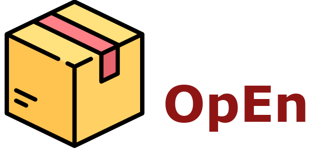
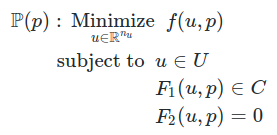

<p align="center">
  <a href="https://alphaville.github.io/optimization-engine/">
    
  </a>
</p>

<p align="center">
  <a href="https://www.codefactor.io/repository/github/alphaville/optimization-engine">
  </a> 
  <a href="https://github.com/alphaville/optimization-engine/actions?query=branch%3Amaster">
    
  </a>
  <a href="https://ci.appveyor.com/project/alphaville/optimization-engine/branch/master">
    
  </a>
</p>

<p align="center">
  <a href="https://lbesson.mit-license.org/">
    
  </a>
  <a href="https://github.com/alphaville/optimization-engine/blob/master/LICENSE-APACHE">
    
  </a>
</p>

<p align="center">
  <a href="https://gitter.im/alphaville/optimization-engine?utm_source=badge&utm_medium=badge&utm_campaign=pr-badge">
    
  </a>
   <a href="https://twitter.com/intent/tweet?text=Fast%20and%20accurate%20nonconvex%20optimization&url=https://alphaville.github.io/optimization-engine/&via=isToxic&hashtags=optimization,rustlang,matlab,python">
    
  </a>
  <a href="https://discord.gg/mfYpn4V">
    
  </a>
</p>

Optimization Engine (OpEn) is a solver for Fast & Accurate Embedded Optimization for next-generation Robotics and Autonomous Systems.

**Documentation available at** [**alphaville.github.io/optimization-engine**](https://alphaville.github.io/optimization-engine/)

## Table of contents

- [Features](#features)
- [Demos](#demos)
  - [Code generation](#code-generation)
  - [Embedded applications](#embedded-applications)
- [Parametric optimization problems](#parametric-problems)
- [Code generation example](#code-generation-example)
- [Getting started](#getting-started)
- [Contact](#contact-us)
- [Show us your love](#do-you-like-open)
- [Licence](#license)
- [Core team](#core-team)
- [Contributions](#contributions)
- [Cite OpEn](#citing-open)

## Features

**OpEn** is the counterpart of CVXGen for nonconvex problems.

- Fast nonconvex parametric optimization
- Numerical algorithm written in Rust
- Provably safe memory management
- Auto-generation of ROS packages

**OpEn** is ideal for:

- Embedded **Nonlinear Model Predictive Control**,
- Embedded **Nonlinear Moving Horizon Estimation** and their applications in 
- Robotics and Advanced Manufacturing Systems
- Autonomous vehicles
- Aerial Vehicles and Aerospace


## Demos

### Code generation

Code generation? Piece of cake!

**OpEn** generates parametric optimizer modules in Rust - it's blazingly fast - it's safe - it can run on embedded devices.

You can use the [MATLAB](https://alphaville.github.io/optimization-engine/docs/matlab-interface) or [Python interface](https://alphaville.github.io/optimization-engine/docs/python-interface) of OpEn to generate Rust code for your parametric optimizer.

This can then be called directly, using Rust, or, it can be consumed as a service over a socket.


You can generate a parametric optimizer in just very few lines of code and in no time.

OpEn allows application developers and researchers to focus on the challenges of the application, rather than the tedious task of solving the associated parametric optimization problems (as in nonlinear model predictive control).

### Embedded applications
OpEn can run on embedded devices; here we see it running on an intel Atom for the autonomous navigation of a lab-scale micro aerial vehicle - the controller runs at **20Hz** using only **15%** CPU!


## Parametric Problems

**OpEn** can solve nonconvex parametric optimization problems of the general form



where *f* is a smooth cost, *U* is a simple - possibly nonconvex - set, *F<sub>1</sub>* and *F<sub>2</sub>* are nonlinear smooth mappings and *C* is a convex set ([read more](https://alphaville.github.io/optimization-engine/docs/open-intro)).

## Code Generation Example

Code generation in **Python** in just a few lines of code (read the [docs](https://alphaville.github.io/optimization-engine/docs/python-examples) for details)

```python
import opengen as og
import casadi.casadi as cs

# Define variables
# ------------------------------------
u = cs.SX.sym("u", 5)
p = cs.SX.sym("p", 2)

# Define cost function and constraints
# ------------------------------------
phi = og.functions.rosenbrock(u, p)
f2 = cs.vertcat(1.5 * u[0] - u[1],
                cs.fmax(0.0, u[2] - u[3] + 0.1))
bounds = og.constraints.Ball2(None, 1.5)
problem = og.builder.Problem(u, p, phi) \
    .with_penalty_constraints(f2)       \
    .with_constraints(bounds)
    
# Configuration and code generation
# ------------------------------------
build_config = og.config.BuildConfiguration()  \
    .with_build_directory("python_test_build") \
    .with_tcp_interface_config()
meta = og.config.OptimizerMeta()
solver_config = og.config.SolverConfiguration()    \
    .with_tolerance(1e-5)                          \
    .with_constraints_tolerance(1e-4)
builder = og.builder.OpEnOptimizerBuilder(problem, meta,
                                          build_config, solver_config)
builder.build()
```

Code generation in a few lines of **MATLAB** code (read the [docs](https://alphaville.github.io/optimization-engine/docs/matlab-interface) for details)

```matlab
% Define variables
% ------------------------------------
u = casadi.SX.sym('u', 5);
p = casadi.SX.sym('p', 2);

% Define cost function and constraints
% ------------------------------------
phi = rosenbrock(u, p);
f2 = [1.5*u(1) - u(2);
      max(0, u(3)-u(4)+0.1)];

bounds = OpEnConstraints.make_ball_at_origin(5.0);

opEnBuilder = OpEnOptimizerBuilder()...
    .with_problem(u, p, phi, bounds)...
    .with_build_name('penalty_new')...
    .with_fpr_tolerance(1e-5)...
    .with_constraints_as_penalties(f2);

opEnOptimizer = opEnBuilder.build();
```


## Getting started

- [More information about OpEn](https://alphaville.github.io/optimization-engine/docs/open-intro)
- [Quick installation guide](https://alphaville.github.io/optimization-engine/docs/installation)
- [OpEn in Rust](https://alphaville.github.io/optimization-engine/docs/openrust-basic)
- [OpEn in Python](https://alphaville.github.io/optimization-engine/docs/python-interface) ([Examples](https://alphaville.github.io/optimization-engine/docs/python-examples))
- [OpEn in MATLAB](https://alphaville.github.io/optimization-engine/docs/matlab-interface) ([Examples](https://alphaville.github.io/optimization-engine/docs/matlab-examples))
- [OpEn+Jupyter in Docker](https://alphaville.github.io/optimization-engine/docs/docker)
- [Generation of ROS packages](https://alphaville.github.io/optimization-engine/docs/python-ros)
- [Call OpEn in C/C++](https://alphaville.github.io/optimization-engine/docs/python-c)
- [TCP/IP interface of OpEn](https://alphaville.github.io/optimization-engine/docs/python-tcp-ip)
- [Frequently asked questions](https://alphaville.github.io/optimization-engine/docs/faq)

## Contact us

- **Join the discussion on [Discord](https://discord.gg/mfYpn4V)**
- Reach us on [Gitter](https://gitter.im/alphaville/optimization-engine)

## Do you like OpEn?

Show us with a star on github...


## License

OpEn is a free open source project. You can use it under the terms of either [Apache license v2.0](LICENSE-APACHE) or [MIT license](LICENSE-MIT).


## Core Team

<table>
  <tbody>
    <tr>
      <td align="center" valign="top">
        
        <br>
        <a href="https://alphaville.github.io">Pantelis Sopasakis</a> 
      </td>
      <td align="center" valign="top">
        
        <br>
        <a href="https://github.com/korken89">Emil Fresk</a>     
      </td>
     </tr>
  </tbody>
</table>


## Contributions

Unless you explicitly state otherwise, any contribution intentionally submitted for inclusion in the work by you, as defined in the Apache-2.0 license, shall be dual licensed as above, without any additional terms or conditions.

Before you contribute to Optimization Engine, please read our [contributing guidelines](https://alphaville.github.io/optimization-engine/docs/contributing).

A list of contributors is automatically generated by github [here](https://github.com/alphaville/optimization-engine/graphs/contributors).


## Citing OpEn

Please, cite OpEn as follows ([arXiv version](https://arxiv.org/abs/2003.00292)):

```
@inproceedings{open2020,
  author="P. Sopasakis and E. Fresk and P. Patrinos",
  title="{OpEn}: Code Generation for Embedded Nonconvex Optimization",
  booktitle="IFAC World Congress",
  year="2020",
  address="Berlin"
}
```
