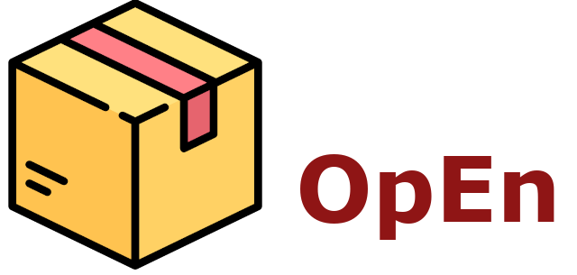

<p align="center">
  <a href="https://alphaville.github.io/optimization-engine/">
    
  </a>
</p>

<p align="center">
  <a href="https://www.codefactor.io/repository/github/alphaville/optimization-engine">
  </a> 
  <a href="https://github.com/alphaville/optimization-engine/actions?query=branch%3Amaster">
    
  </a>
  <a href="https://ci.appveyor.com/project/alphaville/optimization-engine/branch/master">
    
  </a>
  <br>
  <a href="https://lbesson.mit-license.org/">
    
  </a>
  <a href="https://github.com/alphaville/optimization-engine/blob/master/LICENSE-APACHE">
    
  </a>
  <a href="https://discord.gg/mfYpn4V">
    
  </a>
</p>


Optimization Engine (OpEn) is a solver for Fast & Accurate Embedded Optimization for next-generation Robotics and Autonomous Systems. Read on to see how you can use OpEn on your robot today.

**Documentation available at** [**alphaville.github.io/optimization-engine**](https://alphaville.github.io/optimization-engine/)


## Features

**OpEn** is the counterpart of CVXGen for nonconvex problems.

- Fast nonconvex parametric optimization
- Numerical algorithm written in Rust
- Provably safe memory management
- Auto-generation of ROS packages

**OpEn** is ideal for:

- Embedded **nonlinear nonlinear model predictive control** and **moving horizon estimation**
- Robotics and advanced manufacturing 
- Autonomous (aerial/ground) vehicles


## Demos

### Code generation

Code generation? Piece of cake!

**OpEn** generates parametric optimizer modules in Rust - it's blazingly fast - it's safe - it can run on embedded devices.

You can use the [Python interface](https://alphaville.github.io/optimization-engine/docs/python-interface) of OpEn, `opengen`, to generate Rust code for your parametric optimizer. The optimizer can then be called from Python, used as a solver in Rust, consumed as a service over TCP (even remotely), or used in ROS on your robot.


You can generate a parametric optimizer in just very few lines of code and in no time.

OpEn allows application developers and researchers to focus on the challenges of the application, rather than the tedious task of solving the associated parametric optimization problems (as in nonlinear model predictive control).

### Embedded applications
OpEn can run on embedded devices; here we see it running on an intel Atom for the autonomous navigation of a lab-scale micro aerial vehicle - the controller runs at **20Hz** using only **15%** CPU!


## Optimal Control

Optimal control problems can now be set up directly from their natural ingredients: dynamics, prediction horizon, stage cost, terminal cost, and constraints. You can easily choose between a single or multiple shooting formulation. The solver is parametrizable, so you don't have to recompile whenever a parameter changes.

OpEn allows to solve optimal control problems of the form


Here is a minimal Python example (try it in [Google Colab](https://colab.research.google.com/drive/17vbVUbqcah9seIg17aN6bW0-T15FWrBo?usp=sharing)):

<a href="https://colab.research.google.com/drive/17vbVUbqcah9seIg17aN6bW0-T15FWrBo?usp=sharing" target="_blank">
  
</a>


```python
import opengen as og
import casadi.casadi as cs

ocp = og.ocp.OptimalControlProblem(nx=2, nu=1, horizon=20)
ocp.add_parameter("x0", 2)
ocp.add_parameter("xref", 2, default=[0.0, 0.0])

ocp.with_dynamics(
  lambda x, u, p: 
    cs.vertcat(x[1], -x[0] + u[0]))

ocp.with_stage_cost(
  lambda x, u, p, t: 
    cs.dot(x - p["xref"], x - p["xref"]) 
    + 0.1 * cs.dot(u, u))

ocp.with_terminal_cost(
  lambda x, p: 
    10.0 * cs.dot(x - p["xref"], x - p["xref"]))

ocp.with_input_constraints(og.constraints.BallInf(radius=1.))

optimizer = og.ocp.OCPBuilder(
    ocp, 
    meta=..., 
    build_config=..., 
    solver_config=...).build()

result = optimizer.solve(x0=[1.0, 0.0], xref=[0.0, 0.0])
```

See the dedicated [OCP documentation](https://alphaville.github.io/optimization-engine/docs/python-ocp-1) for more details and examples.

## General Parametric Optimization

**OpEn** can solve nonconvex parametric optimization problems of the general form


where *f* is a smooth cost, *U* is a simple - possibly nonconvex - set, *F<sub>1</sub>* and *F<sub>2</sub>* are nonlinear smooth mappings and *C* is a convex set ([read more](https://alphaville.github.io/optimization-engine/docs/open-intro)).


Code generation in **Python** in just a few lines of code (read the [docs](https://alphaville.github.io/optimization-engine/docs/python-examples) for details)

<a href="https://colab.research.google.com/drive/14F6IQWo8Q65mIz5Ru4FGxRPqyFMRMyzE?usp=sharing" target="_blank">
  
</a>

```python
import opengen as og
import casadi.casadi as cs

# Define variables
# ------------------------------------
u = cs.SX.sym("u", 5)
p = cs.SX.sym("p", 2)

# Define cost function and constraints
# ------------------------------------
phi = og.functions.rosenbrock(u, p)
f2 = cs.vertcat(1.5 * u[0] - u[1],
                cs.fmax(0.0, u[2] - u[3] + 0.1))
bounds = og.constraints.Ball2(None, 1.5)
problem = og.builder.Problem(u, p, phi) \
    .with_penalty_constraints(f2)       \
    .with_constraints(bounds)
    
# Configuration and code generation
# ------------------------------------
build_config = og.config.BuildConfiguration()  \
    .with_build_directory("python_test_build") \
    .with_tcp_interface_config()
meta = og.config.OptimizerMeta()
solver_config = og.config.SolverConfiguration()    \
    .with_tolerance(1e-5)                          \
    .with_constraints_tolerance(1e-4)
builder = og.builder.OpEnOptimizerBuilder(problem, meta,
                                          build_config, solver_config)
builder.build()
```

## Use the Solver in Rust

You can also use OpEn directly in Rust by defining a cost function, its gradient, and a set of constraints, then solving the problem.

Here is a minimal Rust example:

```rust
use optimization_engine::{constraints, panoc::*, Problem, SolverError};

let f = |u: &[f64], c: &mut f64| -> Result<(), SolverError> {
    *c = (1.0 - u[0]).powi(2) + 200.0 * (u[1] - u[0].powi(2)).powi(2);
    Ok(())
};

let df = |u: &[f64], grad: &mut [f64]| -> Result<(), SolverError> {
    grad[0] = 2.0 * (u[0] - 1.0) - 800.0 * u[0] * (u[1] - u[0].powi(2));
    grad[1] = 400.0 * (u[1] - u[0].powi(2));
    Ok(())
};

let bounds = constraints::Ball2::new(None, 1.0);
let problem = Problem::new(&bounds, df, f);
let mut cache = PANOCCache::new(2, 1e-8, 10);
let mut optimizer = PANOCOptimizer::new(problem, &mut cache).with_max_iter(100);
let mut u = [-1.5, 0.9];
let status = optimizer.solve(&mut u)?;
```

See the dedicated [Rust documentation](https://alphaville.github.io/optimization-engine/docs/openrust-basic) for a full introduction and more complete examples.
See more Rust examples [here](rust/examples).

## Check out next...

- [More information about OpEn](https://alphaville.github.io/optimization-engine/docs/open-intro)
- [Quick installation guide](https://alphaville.github.io/optimization-engine/docs/installation)
- [OpEn in Rust](https://alphaville.github.io/optimization-engine/docs/openrust-basic)
- [OpEn in Python](https://alphaville.github.io/optimization-engine/docs/python-interface) ([Examples](https://alphaville.github.io/optimization-engine/docs/python-examples))
- [Optimal control](https://alphaville.github.io/optimization-engine/docs/python-ocp-1)
- [OpEn+Jupyter in Docker](https://alphaville.github.io/optimization-engine/docs/docker)
- [Generation of ROS packages](https://alphaville.github.io/optimization-engine/docs/python-ros)
- [Call OpEn in C/C++](https://alphaville.github.io/optimization-engine/docs/python-c)
- [TCP/IP interface of OpEn](https://alphaville.github.io/optimization-engine/docs/python-tcp-ip)
- [Frequently asked questions](https://alphaville.github.io/optimization-engine/docs/faq)

## Contact us

- **Join the discussion on [Discord](https://discord.gg/mfYpn4V)**
- Reach us on [Gitter](https://gitter.im/alphaville/optimization-engine)

## Do you like OpEn?

Show us with a star on github...


## License

OpEn is a free open source project. You can use it under the terms of either [Apache license v2.0](LICENSE-APACHE) or [MIT license](LICENSE-MIT).


## Core Team

<table>
  <tbody>
    <tr>
      <td align="center" valign="top">
        
        <br>
        <a href="https://alphaville.github.io">Pantelis Sopasakis</a> 
      </td>
      <td align="center" valign="top">
        
        <br>
        <a href="https://github.com/korken89">Emil Fresk</a>     
      </td>
     </tr>
  </tbody>
</table>


## Contributions

Unless you explicitly state otherwise, any contribution intentionally submitted for inclusion in the work by you, as defined in the Apache-2.0 license, shall be dual licensed as above, without any additional terms or conditions.

Before you contribute to Optimization Engine, please read our [contributing guidelines](https://alphaville.github.io/optimization-engine/docs/contributing).

A list of contributors is automatically generated by github [here](https://github.com/alphaville/optimization-engine/graphs/contributors).


## Citing OpEn

Please, cite OpEn as follows ([arXiv version](https://arxiv.org/abs/2003.00292)):

```
@inproceedings{open2020,
  author="P. Sopasakis and E. Fresk and P. Patrinos",
  title="{OpEn}: Code Generation for Embedded Nonconvex Optimization",
  booktitle="IFAC World Congress",
  year="2020",
  address="Berlin"
}
```
